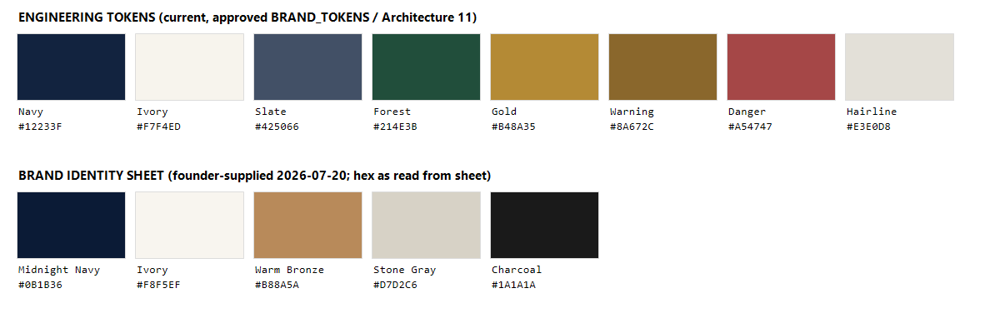

# Brand Reconciliation Proposal — one decision before M4

**Status:** RESOLVED (founder ruled 2026-07-21). This proposal is retained for
history; the **canonical** brand source of truth is now the brand package:
`Brand_Guide_v1.0.md`, `BRAND_TOKENS.md`, `DESIGN_SYSTEM.md`, `LOGO_USAGE.md`.
Official palette adopted: navy `#081B36`, ivory `#F8F5EF`, bronze `#B88A5A`,
stone gray `#D7D2C6`, charcoal `#1A1A1A` (this doc's earlier `#0B1B36` navy
reading was superseded by the founder-confirmed `#081B36`).

**Original status:** PROPOSED (founder decision required before M4-A begins)
**Date:** 2026-07-20 · **Change level if adopted:** 2 (design-system change
touching every screen; single migration of token values, no behavior change)

The engineering tokens (approved via Architecture §11 / BRAND_TOKENS, built in
M1) and the founder-supplied brand identity sheet (2026-07-20) disagree in
places. Both are shown side by side below. Nothing has been changed — per
founder direction the tokens stay as-is until this decision.

## Color

| Role | Engineering token | Identity sheet | Assessment |
|---|---|---|---|
| Primary dark | `#12233F` navy | `#0B1B36` midnight navy | Sheet is deeper/darker; both pass AA on ivory. Low-cost swap. |
| Background | `#F7F4ED` ivory | `#F8F5EF` ivory | Visually near-identical. Trivial. |
| Accent | `#B48A35` gold | `#B88A5A` warm bronze | Real difference: bronze is lighter/warmer. **Caution:** as small text on white (role chips), bronze contrast is weaker than gold — if adopted, accent *text* may need a darkened variant while surfaces use bronze. |
| Slate / secondary | `#425066` | — (stone gray `#D7D2C6`, charcoal `#1A1A1A`) | Sheet has no mid-tone text color; keep slate regardless. Stone gray could replace hairline `#E3E0D8`. |
| Forest / warning / danger | present | absent | Product needs status colors the identity sheet doesn't define; keep them, tuned to whichever palette wins. |

**Hex caveat:** sheet values were read from the supplied raster — confirm from
the source design file at decision time.

## Typography

| Role | Engineering (Q-8 fallback, in product) | Identity sheet | Implication |
|---|---|---|---|
| Display/serif | Source Serif 4 (open license) | Trajan Pro (display), Cormorant Garamond (editorial) | Trajan Pro and Suisse Int'l are **commercially licensed** — adopting them is a licensing purchase + Q-2-style vendor decision, not just a token edit. Cormorant Garamond is open (Google Fonts). |
| Interface/body | Inter (open license) | Suisse Int'l | Same licensing consideration. |

## Options

- **A — Adopt the identity sheet palette now (recommended for color):** swap
  navy/ivory, adopt bronze with a darkened text-accent variant, keep slate +
  status colors. One session including re-verifying token tests and screens.
  Fonts unchanged pending licensing.
- **B — Keep engineering tokens:** zero work; the product and the printed brand
  will visibly diverge (navy and accent differ noticeably side by side).
- **C — Full adoption including fonts:** requires font license purchases
  (Trajan Pro, Suisse Int'l) or founder-approved open substitutes (e.g.
  Cormorant Garamond for editorial); larger visual QA pass.

**CTO recommendation:** Option A before M4-A (color is cheap now, expensive
later), defer the font decision to a separate licensing ruling — the current
Source Serif 4 + Inter pairing is professional and unblocks everything.

**Decision requested:** A, B, or C — plus, if A/C, confirmation of the exact
hex values from the identity source file.
