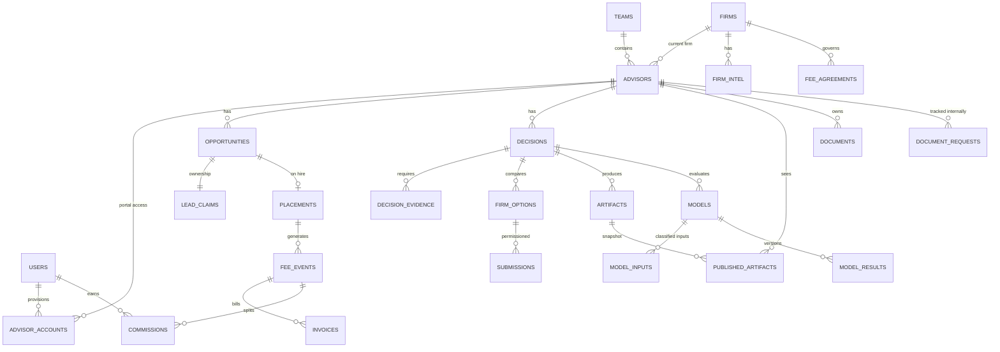

# VYNE Platform — Phase 1 Architecture Package v1.2

> **v1.1 change (Founder Direction):** Advisor Studio is read-only in Version 1 — uploads, messaging, and vault removed/deferred. Documents flow to VYNE outside the platform; VYNE publishes analysis back.
> **v1.2 change (Founder Direction, approved):** Adds **Section 0 — Compliance by Design** as permanent architectural guardrails; adopts **data minimization** as a foundational product principle; explicitly **prohibits client PII and advisor CRM/client data** in Version 1; reframes Advisor Studio as a **curated executive workspace**. Sections 0, 4, 12, 13, 17, 18 updated.

---

## 0. Compliance by Design (permanent guardrails)

These principles govern every current and future feature. A feature that cannot satisfy them is redesigned or rejected — regardless of how useful it appears. Any exception requires a written founder decision recorded in the decision log.

**0.1 Data minimization.** VYNE collects, processes, and retains only information necessary to deliver transition-consulting services. If the service can be delivered without a data element, the platform does not collect or store it. Every new table, field, and document classification added in the future must state, in its migration or ADR, *why the service requires it*.

**0.2 Prohibited data (Version 1).** The platform must not store client personally identifiable information or advisor CRM data, including but not limited to: client names; client contact information; account numbers; Social Security numbers; client account statements; CRM exports containing client records; portfolio reports with identifiable client information. The system is designed around **advisor business information** (production, AUM, mix, structure, economics, goals) — never client information.

*Enforcement is layered, because a prohibition that lives only in a policy document is not a control:*
- **Intake attestation:** every internal document upload requires the uploader to confirm "contains no client PII or client-level records" before save; the attestation is stored with the document and audit-logged.
- **Aggregate-only data model:** advisor records capture practice-level aggregates (client count, AUM bands, segment counts, revenue mix). No table in the schema has a place for a client entity — prohibited data has no home, structurally.
- **Screening at ingestion:** staff procedure requires visual screening of received documents; if a document contains prohibited data (e.g., a firm-produced report with client names), the advisor is asked for a redacted version, or VYNE extracts only the aggregate figures and does not retain the source.
- **Periodic audit:** quarterly sample review of stored documents against the prohibition; findings logged.
- **AI boundary:** agents (Phase 7) may never be pointed at documents that failed or lack attestation.

**0.3 Least privilege.** Every role, service identity, and agent receives the minimum access required, enforced at the database (RLS) — never solely in the UI.

**0.4 Privacy by design.** Privacy consequences are evaluated at design time, not retrofitted. Defaults favor non-collection, `internal_only`, and shortest defensible retention.

**0.5 Security by default.** New surfaces ship closed: authentication required, RLS denies until policies grant, storage private, links signed and expiring, MFA available, secrets vaulted.

**0.6 Auditability.** Material reads, writes, approvals, publications, withdrawals, permission changes, exports, and restricted downloads are append-only logged with actor and timestamp. If an action matters, it is reconstructable.

**0.7 Human review before publication.** No content reaches an advisor without explicit human approval and publication. This applies with no exceptions to AI-generated content, forever.

**0.8 Separation of internal analysis and advisor-facing content.** Internal reasoning, notes, rankings, economics, and drafts live in a different structural layer than published artifacts. Publication is a deliberate copy across that boundary — never a visibility toggle.

**0.9 No unnecessary regulated information.** Where a data category would trigger regulatory obligations (client PII, account-level records, tax identifiers, health or biometric data), the default answer is: do not collect it. Reintroduction of any such category requires legal review *before* schema work begins.

---

**Status:** Awaiting founder approval before any production code
**Date:** July 17, 2026
**Governing sources (in authority order):** Master Build Prompt → Product Boundaries & Security → Constitution (Vol I) → Framework & VYNE's 9 (Vol II) → Client Experience (Vol III) → Decision Library (Vol IV) → Deliverables Toolkit (Vol V) → Founder Operating System (Vol VI) → Canonical Architecture & Language Guide → Technical specs → Prototypes

---

## 1. Executive Review

VYNE is a decision-consulting institution for financial advisors, monetized primarily through firm-paid placement fees. The platform must serve one founder today and a small team (1–3 contractor recruiters, possibly an analyst) within 24 months.

**What exists:** Eight canonical governance documents; a CRM v4 prototype (single-file HTML, 15 modules, localStorage persistence, no authentication); website copy/wireframe specs; an AEO blueprint; financial models; brand tokens.

**Honest assessment of readiness:**
- The *information architecture* of CRM v4 is production-worthy. The *implementation* is not — it is a design prototype and must be treated as such (Vol VI, §30 agrees).
- The canonical volumes are strong on principles and workflow but headline-level on field definitions. The canonical data dictionary in this package fills that gap and should be treated as the source of truth going forward, amended by founder decision.
- The single highest-risk element in the whole system is the **publication boundary** (VYNE OS → Advisor Studio). It is also the single most differentiating element. It is built first (vertical slice) for exactly that reason.

**Right-sizing note:** Several documents describe apparatus for a much larger firm (six named AI agents, recruiter dashboards, quarterly knowledge reviews). None of it is wrong, but the build order below sequences a **Minimum Viable Founder OS** (Vol VI, §32) ahead of everything speculative. The architecture leaves doors open; the build plan doesn't walk through them yet.

---

## 2. Keep / Improve / Remove — CRM v4 Analysis

Reviewed: `VYNE_Internal_Intelligence_CRM_v4.html` (458KB), `VYNE_Internal_Intelligence_CRM_v3.html`, `vyne_v4_patch.js` (86KB), `vyne_v4_patch.css`.

### KEEP (concept and IA carried into VYNE OS)
| Element | Reason |
|---|---|
| Sidebar module structure: Command Center, Pipeline, Advisors, Teams, Firm Intelligence, Portfolio Intelligence, Enterprise Economics, Submissions, Fees, Accounting, Forecast, Agents, Authority Engine, Calendar, Users | Advisor-centric, matches Vol VI entity map. Naming ("Enterprise Economics," "Firm Intelligence," "Authority Engine") is distinctive — retain. |
| Advisor detail with ROOT / Vision / Objectives / Meetings / Documents / Economics tabs | Directly maps to the Framework and Decision Readiness track |
| Pipeline stages (Prospect → Discovery → Modeling → Presented → In Contention → Submitted → Offer → Signed → Hired, + On Hold / Lost) | Practical commercial stages; matches Vol VI's "commercial pipeline ≠ decision readiness" rule once the readiness track is added alongside |
| Invoice status lifecycle (Draft/Sent/Overdue/Paid/Void), fee & accounting concepts | Maps cleanly to fee_events / invoices schema below |
| Compensation modeling + deal builder concepts | Becomes the Modeling Workspace with governed assumptions |
| Presentation mode + print styles | Becomes Advisor Studio "published artifact" and PDF generation |

### IMPROVE (rebuilt on new foundation, behavior preserved)
| Element | Change |
|---|---|
| Data layer | localStorage → PostgreSQL with RLS. **Non-negotiable.** |
| Typography | Georgia/Times serif headings + Inter body → licensed editorial serif for headings (see Design System) + Inter/Geist UI. Current serif reads as default, not premium. |
| Visual density | ~40% reduction in cards/borders; larger type scale; more whitespace per brand tokens |
| Status pills / color coding | Keep the concept, rebuild on design tokens (current palette drifts from BRAND_TOKENS.md — see Conflict Log C-3) |
| Dashboard | KPI ribbon → founder operating review layout (Vol VI, §26 + Appendix B) |
| "Agents" module | Keep the nav slot; gut the implementation until Phase 7 (AI comes last, per Master Build Prompt) |

### REMOVE
| Element | Reason |
|---|---|
| All localStorage persistence for business data | Security requirement |
| Client-side-only "views" as security boundary | UI filtering is explicitly insufficient |
| Inline monolithic 458KB HTML architecture | Unmaintainable; replaced by componentized app |
| Any seeded demo data implying real firms' confidential terms | Legal exposure; replace with clearly synthetic seed data |
| v3 file entirely | Superseded; archive only |

---

## 3. Product Architecture

```
                        vyne.com  (Public Website)
                              │  inquiry, insights, login entry
        ┌─────────────────────┼──────────────────────┐
        │                     │                      │
   os.vyne.com          studio.vyne.com        (modeling lives inside
   VYNE OS              Advisor Studio          VYNE OS; publishes
   internal only        advisor-facing          snapshots to Studio)
        │                     │
        └────────┬────────────┘
                 │
        Shared platform layer
        ├─ PostgreSQL (single DB, RLS on every table)
        ├─ Auth (single provider, role-scoped JWT claims)
        ├─ Private object storage (signed URLs)
        ├─ Audit log service (append-only)
        └─ PDF/render service
```

**Monorepo layout:**
```
vyne/
├─ apps/
│  ├─ web/        # public site (Next.js, mostly static + CMS content)
│  ├─ os/         # VYNE OS (Next.js app, internal roles only)
│  └─ studio/     # Advisor Studio (Next.js app, advisor role only)
├─ packages/
│  ├─ db/         # schema, migrations, RLS policies, seed
│  ├─ ui/         # design tokens + shared components
│  ├─ domain/     # zod schemas, status dictionaries, commission logic
│  ├─ audit/      # audit event definitions and writer
│  └─ pdf/        # branded artifact rendering
└─ docs/          # this package, ADRs, runbooks
```

**Key architectural decisions (ADRs):**
1. **One database, three apps.** Separation is enforced by RLS + role claims, not by separate databases. Advisor Studio's queryable surface is restricted to `published_artifacts` and its satellites — advisors have *no* RLS path to internal tables at all.
2. **Publication is a copy, not a view.** Publishing creates an immutable snapshot (content + rendered PDF) in `published_artifacts`. Internal edits after publication never leak; withdrawal hides the snapshot from Studio but preserves it for audit. This satisfies "published versions must remain reproducible" (Vol VI §23) with the simplest possible security model.
3. **Modeling Workspace is a module inside VYNE OS**, not a fourth deployed app, for v1. Advisor-safe output reaches Studio only via publication. (Deviation from the four-product framing — justification: one user today; a separate app adds deployment surface with zero benefit. Revisit if advisors ever get live model access.)
4. **Commercial stage and decision readiness are separate columns/tables that render together and never merge** (Vol VI §9).

---

## 4. Database Schema (proposal)

Governed by §0 (Compliance by Design). Note the deliberate structural choice: **there is no client entity anywhere in this schema.** Advisor practice data is aggregate-only.

PostgreSQL. All tables: `id uuid pk default gen_random_uuid()`, `created_at`, `updated_at`, `created_by`, `deleted_at` (soft delete), RLS enabled. Enums via lookup-constrained text for evolvability.

### Identity & access
```sql
users            (id, auth_id unique, email, full_name, role, status, mfa_enrolled, last_login_at)
                 -- role: founder | recruiter | analyst | operations | finance | advisor
advisor_accounts (id, user_id fk users, advisor_id fk advisors, status, provisioned_by, provisioned_at)
record_access    (id, user_id, record_type, record_id, access_level, granted_by, granted_at, revoked_at)
                 -- explicit grants beyond ownership; access_level: view | edit
```

### Relationship core
```sql
advisors      (id, first_name, last_name, email, phone, city, state, current_firm_id fk firms,
               channel, aum, t12_reported, t12_verified, t12_verified_at, t12_evidence_doc_id,
               client_count_band, segment_mix jsonb, revenue_mix jsonb,  -- aggregates only (§0.2)
               source, source_detail, relationship_owner_id fk users, commercial_owner_id fk users,
               restrictions text, confidentiality_level, team_id fk teams null, status)
teams         (id, name, primary_advisor_id, total_aum, total_t12, notes_summary)
contacts      (id, firm_id null, advisor_id null, name, title, email, phone, contact_type)
firms         (id, name, channel, parent_company, headcount_estimate, fee_agreement_status,
               restricted boolean, restriction_reason, research_confidence, profile jsonb)
firm_intel    (id, firm_id, category, claim, source, source_date, confidence, stale_after,
               verified_by, internal_only boolean default true)
```

### Commercial & decision
```sql
opportunities (id, advisor_id, team_id null, stage, stage_changed_at, expected_fee_pct,
               expected_fee_amount, probability_note, primary_recruiter_id fk users null,
               lead_ownership_id fk lead_claims, on_hold_reason, lost_reason)
lead_claims   (id, advisor_id, claimant_user_id, claimed_at, evidence, status,
               ruled_by, ruled_at, ruling_note)   -- ownership disputes preserved, per Vol VI §13
decisions     (id, advisor_id, opportunity_id null, decision_type,  -- from Decision Library taxonomy
               status, is_primary boolean, readiness jsonb,          -- 8 readiness dimensions
               current_state)  -- STAY | STRENGTHEN | PREPARE | MOVE | CONTINUE_DILIGENCE
decision_evidence (id, decision_id, dimension, description, status, due_at, doc_id null)
firm_options  (id, decision_id, firm_id, status, advisor_permission boolean default false,
               permission_granted_at, permission_evidence)
submissions   (id, firm_option_id, submitted_at, submitted_by, firm_contact_id, status, response_note)
              -- CHECK: cannot exist unless firm_option.advisor_permission = true (also app-enforced)
```

### Activity & work
```sql
activities (id, actor_id, advisor_id null, opportunity_id null, decision_id null, firm_id null,
            type, occurred_at, summary, detail, internal_only boolean default true)
tasks      (id, owner_id, title, detail, due_at, priority, status, source_activity_id null,
            advisor_id null, opportunity_id null, decision_id null, firm_id null,
            completion_evidence, advisor_visible boolean default false)
meetings   (id, advisor_id, decision_id null, meeting_type, held_at, agenda, internal_notes,
            advisor_summary_draft, prepared_by)
```

### Artifacts, documents, publication
```sql
documents  (id, storage_key, filename, mime, size, classification,
            -- classification: internal_only | advisor_provided | firm_provided | deliverable_draft | published
            advisor_id null, firm_id null, decision_id null, uploaded_by, received_via null,
            no_client_pii_attested boolean not null, attested_by, attested_at,
            virus_scanned_at)
artifacts  (id, decision_id, artifact_type,
            -- current_reality | future_state_mandate | vynes_9_profile | constraint_map |
            -- alternative_comparison | scorecard | economic_model_report | decision_record | action_path
            version int, status,  -- draft | in_review | approved | published | superseded | withdrawn
            content jsonb, reviewed_by, approved_by, approved_at)
published_artifacts (id, artifact_id, advisor_id, published_by, published_at,
            content_snapshot jsonb, pdf_doc_id, withdrawn_at null, withdrawn_by null,
            superseded_by null)
-- v1.1: no studio_messages or studio_uploads tables. Advisor-provided materials
-- arrive outside the platform; VYNE staff upload them internally into `documents`
-- with classification='advisor_provided' and received_via ('email' | 'secure_mail' | 'in_person').
document_requests (id, advisor_id, requested_by, request_note, requested_at,
                   fulfilled_doc_id null, fulfilled_at null, status)
                   -- internal tracking only; not advisor-visible in v1
```

### Modeling
```sql
models          (id, decision_id, model_type, version int, status, name)
model_inputs    (id, model_id, key, value numeric/text, classification,
                 -- verified | advisor_provided | firm_provided | estimated | assumption
                 source, source_doc_id null)
model_results   (id, model_id, computed_at, results jsonb, engine_version)
model_scenarios (id, decision_id, name, model_ids uuid[], comparison_note)
```

### Economics
```sql
fee_agreements (id, firm_id, base_pct, stepup_pct null, stepup_threshold null,
                stepup_window, clawback_terms, effective_from, effective_to, doc_id, status)
placements     (id, opportunity_id, firm_id, start_date, verified_t12, t12_evidence_doc_id, status)
fee_events     (id, placement_id, event_type, -- earned | stepup | clawback
                amount, event_date, calculation_note, status)
invoices       (id, placement_id, fee_event_id, number, amount, issued_at, due_at,
                status, -- draft | sent | overdue | paid | void
                paid_at, payment_ref)
commission_plans (id, name, version, effective_from, tiers jsonb, source_split jsonb, status)
commissions    (id, recruiter_id, fee_event_id, plan_id, gross_amount, status,
                -- pending | payable | paid | clawed_back
                paid_at, clawback_of null)
```

### Audit (append-only; no UPDATE/DELETE grants to any role)
```sql
audit_events (id, occurred_at, actor_id, actor_role, event_type, record_type, record_id,
              advisor_id null, before jsonb null, after jsonb null, ip, user_agent)
```

---

## 5. ER Diagram



---

## 6. Permissions Matrix

Legend: **A** = all records · **O** = owned/assigned only · **P** = published-to-me only · **–** = none · *(field-level notes in parens)*

| Capability | Founder | Recruiter | Analyst | Operations | Finance | Advisor |
|---|---|---|---|---|---|---|
| Advisors – view | A | O | O (no fee fields) | A (no fee fields) | A (economics only) | own published profile only |
| Advisors – create/edit | A | O (create → auto-assigned) | – | edit non-commercial | – | – |
| Reassign ownership | A | – | – | – | – | – |
| Firms & firm intel | A | approved-for-work subset | A | A | fee agreements only | – |
| Opportunities/pipeline | A | O | – | view O-adjacent | view amounts | – |
| Decisions & artifacts – edit | A | O (draft only) | O (draft only) | – | – | – |
| Approve artifact | A | – | – | – | – | – |
| Publish/withdraw artifact | A | – (Q-3) | – | – | – | – |
| Advisor Studio content | n/a | n/a | n/a | n/a | n/a | P |
| Document requests (internal tracker) | A | O | O | A | – | – |
| Models – edit | A | O | O | – | – | – |
| Fee agreements / invoices | A | – | – | – | A | – |
| Commissions | A | **own only** | – | – | A | – |
| Company financial dashboards | A | – | – | – | A | – |
| Users & roles admin | A | – | – | – | – | – |
| Audit log | A (read) | – | – | – | – | – |
| Bulk export | A (logged) | – | – | – | invoices only | – |

All of the above enforced in **RLS policies**, mirrored in server-side route guards. UI merely reflects it.

---

## 7. User Roles

1. **Founder / Super Admin** — global visibility, sole approval & publication authority (v1), sole ownership-reassignment authority, audit access, user provisioning.
2. **Recruiter** (contractor) — assigned relationships only; own commissions only; cannot self-reassign; access dies instantly on deactivation (JWT revocation + RLS check on `users.status`).
3. **Analyst** — research and draft artifacts on assigned decisions; no fee/commission fields.
4. **Operations** — tasks, documents, submissions logistics; no economics.
5. **Finance** — fee agreements, invoices, collections, commissions; no relationship notes.
6. **Advisor** — Studio only, **read-only plus task acknowledgement**. No uploads, no messaging, no route, query, or storage path into internal data. Optional **Advisor Team Member** sub-role deferred (Q-4).

Roles 3–5 are defined now, built later — v1 provisions only Founder, Recruiter, Advisor.

---

## 8. Route Map

### Public — `vyne.com`
`/` · `/why-vyne` · `/method` (Framework + VYNE's 9 public layer only) · `/services` (ROOT, BRANCH, GROW) · `/decisions/[slug]` (AEO answer pages) · `/insights` + `/insights/[slug]` · `/about` · `/contact` · `/subscribe` · `/login` (routes to Studio) · `/privacy` · `/terms` · `/disclosures`

### VYNE OS — `os.vyne.com` (internal roles)
```
/dashboard                     command center / weekly operating review
/pipeline                      board + table, stage × readiness overlay
/advisors  /advisors/[id]      tabs: overview · reality · direction · vyne-9 ·
                               constraints · options · models · artifacts ·
                               activity · documents · economics · access
/teams /teams/[id]
/firms /firms/[id]             profile · intel · contacts · agreement · submissions
/submissions
/decisions/[id]                decision workspace (scorecard, evidence, options)
/models /models/[id]           modeling workspace
/economics                     fees · invoices · collections · commissions
/forecast
/research                      firm intel review queue, staleness
/authority                     content pipeline (phase 6)
/agents                        AI workspace (phase 7)
/tasks  /calendar
/admin/users /admin/audit /admin/settings
```

### Advisor Studio — `studio.vyne.com` (advisor role)
`/home` (journey + next milestone) · `/journey` (transition timeline) · `/deliverables` + `/deliverables/[id]` (Current Reality, Future-State Mandate, VYNE's 9, Constraint Map, Firm Comparisons) · `/models` (published economic model reports) · `/meetings` (published summaries) · `/tasks` (VYNE-assigned; advisor may mark done) · `/decision-record` · `/settings` (profile, password, MFA)

*Removed in v1.1: `/documents`, `/messages`, all upload flows.*

---

## 9. Screen Inventory (v1.1 scope, ~33 screens)

**OS (24):** Dashboard · Pipeline board · Pipeline table · Advisor list · Advisor overview · Reality tab · Direction tab · VYNE's 9 tab · Constraints tab · Options/submissions tab · Models tab · Artifacts tab · Activity tab · Documents tab · Economics tab · Access tab · Firm list · Firm detail · Fee agreements · Invoices · Commissions · Tasks · Admin users · Audit viewer
**Studio (6):** Home · Journey/timeline · Deliverable reader · Model report reader · Meetings/tasks · Settings
**Public (3 templates):** Marketing page · Insight/AEO article · Contact/inquiry

Each screen ships with loading / empty / error / unauthorized states (required).

---

## 10. Component Library (packages/ui)

**Primitives:** Button (primary/secondary/gold/ghost/destructive) · Input, Select, DatePicker, CurrencyInput · Badge/StatusPill (driven by status dictionary) · Card (single restrained variant) · Table (dense + comfortable) · Tabs · Modal/Drawer · Toast · EmptyState · Skeleton
**Domain components:** AdvisorHeader · StageTracker (commercial) · ReadinessScorecard (8 dimensions, complete/partial/missing) · EvidenceList · FirmOptionCard (with permission state) · ArtifactStatusBar (draft→published lifecycle) · ModelInputRow (with classification chip: verified/provided/estimated/assumption) · ScenarioComparison · FeeEventRow · AuditTrailList · PublishDialog (confirmation + diff of what advisor will see) · StudioDeliverableReader (print-quality)
**PDF templates (packages/pdf):** cover page, section divider, scorecard, comparison table, model report — matching Vol V deliverable standards.

---

## 11. Design System

**Tokens (from BRAND_TOKENS.md — canonical):**
- Navy `#12233F` (primary surface/ink) · Forest `#214E3B` (positive/confirm) · Gold `#B48A35` (rare accent, ≤5% of any screen) · Ivory `#F7F4ED` (light surfaces, print) · Slate `#425066` (secondary text) · White
- Semantic: success=forest, warning=`#8A672C`, danger=`#A54747` (carried from v4, harmonized)

**Typography:** Headings — an editorial serif with a proper license (candidates: **Freight Text Pro**, **Tiempos**, or open-source **Source Serif 4** if no font budget). Body/UI — **Inter**. Numerals — tabular lining in all tables and economics. *Founder decision Q-8 required before build.*

**Rules:** generous whitespace; one card style; hairline borders; no gradients except the existing subtle navy sidebar treatment; motion limited to 150–200ms fades; every table printable; the gold rule (thin horizontal/diagonal line) reserved for report covers and section dividers — never decorative filler.

---

## 12. Security Architecture

*Implements §0 (Compliance by Design). §0 controls prevail if any detail below conflicts.*

**Authentication:** Supabase Auth (or equivalent) — email + password + TOTP MFA (mandatory for internal roles, offered to advisors). Session lifetime: internal 12h with 30-min idle timeout; advisor 24h. Advisors have **zero write paths** except task completion and their own credentials — no uploads, no messages, no comments. Immediate revocation path: `users.status='disabled'` checked in RLS on every query + short-lived JWTs (10 min) with refresh-token invalidation.

**Authorization (defense in depth):**
1. **RLS on every table** — e.g. advisors: `role='founder' OR relationship_owner_id=auth.uid() OR commercial_owner_id=auth.uid() OR EXISTS record_access grant`. Advisor role: RLS grants exist *only* on `published_artifacts` (own), advisor-visible `tasks` (read + status update to done), and own account settings. There is no policy on internal tables for the advisor role — queries return zero rows regardless of URL or API manipulation.
2. **Server route guards** duplicating the same checks (belt and suspenders, and the source of `unauthorized` UI states).
3. **Field-level control** via role-specific database views (e.g. `advisors_analyst_v` excludes fee columns) — not client-side hiding.
4. **Storage:** private buckets only; every download via signed URL (5-min expiry) issued by a server route that re-checks authorization and writes an audit event.

**Audit:** append-only `audit_events`; DB role for app has INSERT only. Logged: logins/failures, record CRUD on core entities, permission grants/revocations, ownership changes, artifact approval/publication/withdrawal, model version creation, fee/commission changes, document views & downloads (restricted classes), exports, admin impersonation (visibly banner-marked if ever enabled).

**Other:** encryption in transit (TLS) and at rest (provider default); daily automated backups + weekly restore test in staging; soft delete everywhere, hard delete only via retention policy; no secrets in repo (env vault); dependency scanning in CI; rate limiting on auth and public forms; synthetic-data-only staging.

**Threat model highlights:** (1) advisor probing internal routes → mitigated by absent RLS policies, not filters; (2) departing recruiter exfiltration → export restrictions, download logging, instant revocation, VYNE data-ownership clause in contractor agreement; (3) firm-confidential intel leakage via publication → publication is founder-gated with a "what the advisor will see" diff; (4) prompt-injection via advisor-provided documents (received by email, uploaded by staff) when AI phases arrive → agents read classified sources only, never auto-publish (Phase 7 gate). v1.1 also removes the direct advisor-upload vector entirely.

**Security acceptance tests** (automated, run in CI): the full list from your message §Security plus Vol VI §33 — recruiter cross-access, URL manipulation, direct API calls, disabled-user session reuse, advisor probing internal endpoints, withdrawn-artifact invisibility, audit completeness. Written as integration tests against a seeded database before Phase 3 begins.

---

## 13. Advisor Studio Architecture (v1.2 — curated executive workspace)

**Philosophy.** Advisor Studio is not merely "read-only." It is a **curated executive workspace**: everything the advisor sees has been intentionally reviewed, approved, and published by VYNE. The experience should feel like receiving personalized strategic guidance from a firm that prepared for the meeting — not like browsing a portal. Design consequences: no generic file lists, no raw data dumps, no unexplained metrics; every screen leads with narrative context ("where you are, what this means, what happens next"); empty states read as anticipation ("Your firm comparison is in preparation") rather than absence.

**Core model — controlled publication (unchanged):**
```
internal artifact (draft) → in review → approved (founder)
      → PUBLISH: immutable snapshot (content jsonb + rendered PDF) written to
        published_artifacts, scoped to one advisor
      → Studio renders snapshots only
      → SUPERSEDE (new version replaces, old retained) or WITHDRAW (hidden, audited)
```
**Studio never queries internal tables.** v1.1 data surface, in full: published artifact snapshots, published meeting summaries, published model reports, VYNE-assigned tasks (advisor may mark complete — the sole advisor write besides credentials), and the transition timeline (derived from published milestones only).

**What Studio displays (v1):** Current Reality · Future-State Mandate · VYNE's 9 · Firm Comparisons · Economic Models · Meeting Summaries · Transition Timeline · Decision Record · VYNE-assigned Tasks.

**Document flow (v1.1):** VYNE requests materials through its approved communication process *outside the platform* (email/secure mail/in person). Staff record the request in the internal `document_requests` tracker, ingest received files into `documents` with `classification='advisor_provided'` and `received_via`, and publish resulting analysis to Studio. Advisors never store confidential business records in the platform.

**Removed/deferred from Studio:** uploads, messaging, secure vault, client file management, comments. The schema does not include these surfaces; reintroducing any of them later is an additive migration plus a fresh security review — deferral costs nothing now.

**Experience:** Home = decision journey position, next milestone, latest published deliverables, open VYNE-assigned tasks. Tone per Vol III: calm, curated, no CRM residue. Provisioning is VYNE-initiated only. All content passes human review before publication (§0.7).

## 14. AI Architecture (designed now, built Phase 7)

**Boundary (Vol VI §25 + Constitution):** AI prepares; humans decide. No agent may publish to Studio, change permissions, send external communications, or mark consequential work complete.

**v1 agent set — deliberately small (three, not six):**
1. **Research assistant** — drafts firm-intel entries from cited public sources into the review queue (`internal_only=true`, `confidence` flagged), never auto-verified.
2. **Meeting assistant** — drafts meeting summaries and proposed tasks from founder notes; drafts advisor-facing summary for human review.
3. **Artifact drafter** — assembles first-draft deliverables from structured records (Reality, Mandate, Scorecard); always enters lifecycle at `draft`.

**Controls:** agents read via the same RLS-scoped service identity (least privilege per agent); every agent write tagged `generated_by`; retrieval sources restricted by document classification; agent actions audit-logged; the six-name taxonomy (Atlas/Sage/etc.) parked as future branding, not architecture.

---

## 15. Migration Plan

1. **Freeze CRM v4** — archive HTML files read-only; label "Prototype v1 — reference only."
2. **Data:** founder confirms whether v4 localStorage holds real records (Q-6). If yes: export JSON via a one-time script, map to new schema, import through validated seed pipeline, verify counts, then purge browser storage. If demo-only: no migration; write fresh synthetic seed data.
3. **Behavioral parity checklist:** each v4 view mapped to its OS route (§8) with a "parity or intentional change" note, so nothing loved gets silently lost.
4. **Formulas:** extract compensation/deal-builder math from v4 JS into `packages/domain` with unit tests against hand-checked cases (Q-7) *before* the Modeling Workspace is built.
5. **Cutover:** OS becomes system of record the day auth + advisors + pipeline + tasks pass acceptance tests; v4 usage stops that day.

---

## 16. Technical Stack Recommendation

Confirming the pack's proposal with specifics:

| Layer | Choice | Note |
|---|---|---|
| Framework | Next.js 15 + TypeScript, App Router | Three apps in one monorepo (Turborepo) |
| DB | PostgreSQL via **Supabase** | RLS, auth, storage, and realtime in one managed service — right-sized for a 1–5 person firm; standard Postgres = no lock-in on data |
| Auth | Supabase Auth + TOTP MFA | |
| ORM | Drizzle (or Prisma) + zod validation in `packages/domain` | Types shared across apps |
| Storage | Supabase Storage, private buckets, signed URLs | |
| Hosting | Vercel (3 projects) + Supabase cloud | |
| Email | Resend | transactional only in v1 |
| PDF | Playwright/Chromium server-side render of artifact templates | matches screen exactly |
| Testing | Vitest (unit) + Playwright (e2e) + pgTAP or SQL tests for RLS | RLS tests are first-class |
| CI | GitHub Actions: typecheck, lint, tests, RLS suite, migration dry-run | |
| Monitoring | Sentry + Supabase logs + uptime check | |

Estimated run cost at v1 scale: roughly $70–150/month.

---

## 17. Risk Register

| # | Risk | Sev | Mitigation |
|---|---|---|---|
| R1 | Publication boundary bug leaks internal data to an advisor | Critical | Snapshot-copy design; no advisor RLS on internal tables; automated boundary tests in CI; founder-gated publish with preview diff |
| R2 | Real advisor data enters system before security review | Critical | Synthetic data until acceptance tests + external review pass (your own requirement) |
| R2b | Confidential documents now travel by email instead of the platform | Med | v1.1 trade-off accepted by founder. Mitigate: define the "approved communication process" concretely (Q-13); prefer password-protected links or secure mail over raw attachments; ingest-and-delete-from-inbox procedure; documents encrypted at rest once inside VYNE OS |
| R3 | Scope: 8 volumes describe a 20-person firm; builder is 1 person | High | MVFOS scope (§19 build order); everything else architecturally reserved, not built |
| R4 | Formula drift between v4 prototype, spec docs, and new engine | High | Single `packages/domain` source of truth + hand-check tests before Modeling ships |
| R5 | Firm-confidential intel repeated in publishable artifacts | High | `internal_only` default on firm_intel; publish preview; language guide checks |
| R6 | Docx volumes are headline-level; field ambiguity mid-build | Med | This package's data dictionary is canonical; changes via decision log only |
| R11 | Prohibited data enters via documents (firm reports, comp statements often embed client rows) | High | §0.2 layered controls: attestation, screening, redaction-or-extract procedure, quarterly audit |
| R12 | Earlier roadmap ideas conflict with §0.2 (see Conflict C-6) | Med | Redesign around aggregates or drop; flagged now to prevent silent scope creep |
| R7 | Font/logo licensing unresolved at launch | Med | Q-8/Q-9 before Phase 2 design tokens lock |
| R8 | Solo-founder key-person risk on ops & security response | Med | Runbooks in /docs; managed services; documented recovery |
| R9 | AEO/content pipeline distracts from revenue-critical OS build | Med | Public site is Phase 6, after OS + Studio slice |
| R10 | Regulatory/privacy exposure handling advisor comp data | Med | Legal + privacy review gate before production data (your Founder Decisions doc already requires this) |

---

## 18. Conflicts Identified + Founder Questions

### Conflict Log (per source-authority rule — flagged, not silently resolved)
- **C-1: Product count.** Master Build Prompt = four deployed products; this architecture makes Modeling a module of VYNE OS for v1 (rationale in ADR-3). *Needs your sign-off as a documented deviation.*
- **C-2: Pipeline stages.** CRM v4 uses 11 stages incl. "Modeling/In Contention"; Vol VI says stages are a founder decision. I propose keeping v4's stages verbatim (they're yours and they work). Confirm.
- **C-3: Palette.** BRAND_TOKENS.md navy `#12233F` vs. CRM v4 `#10243c` vs. earlier chat `#081B36`; gold `#B48A35` vs. v4 champagne `#c5a66a`. BRAND_TOKENS.md treated as canonical. Confirm.
- **C-4: Commission tiers.** Chat history: 55/60/75% tiers with doubts about 75%; commission engine built as **versioned configurable plans** (Vol VI §17), so no number is hard-coded. No decision needed to build; decision needed before first recruiter contract.
- **C-6: Prohibited data vs. earlier roadmap.** Your earlier planning (Platform Specification / chat history) listed future Advisor Studio features that would violate §0.2 as imagined: *account inventory, household inventory, client segmentation, CRM exports, portfolio/product mapping*. These are **not** deferred features — as described, they are now prohibited. Where the underlying need is real (e.g., portability analysis), it will be redesigned around **aggregate, de-identified inputs** (segment counts, AUM bands, product-category percentages) that the advisor computes on their side. Recorded so it never creeps back in by accident.
- **C-5: Agent taxonomy.** AI Agent OS doc names six agents; Phase-7 gate + minimal viable set of three proposed. Confirm.

### Founder Decisions Required (blocking marked ⛔)
- **Q-1** ⛔ (Phase 2) Domains: confirm `vyne.com` ownership status and subdomain plan (`os.` / `studio.`), or actual domain.
- **Q-2** ⛔ Vendor sign-off: Supabase + Vercel + Resend acceptable?
- **Q-3** Can recruiters ever publish to Studio, or is publication founder-only permanently? (v1 assumes founder-only.)
- **Q-4** Advisor team members (assistants/partners) in v1 Studio, or later? (Assumed later.)
- ~~Q-5~~ **Resolved by v1.1 direction:** no Studio messaging; communication stays outside the platform.
- **Q-6** ⛔ (migration) Does your current CRM v4 browser storage contain *real* advisor records that must be migrated, or demo data only?
- **Q-7** ⛔ (Modeling phase) Provide 3–5 hand-calculated model cases (inputs + expected outputs) as the canonical test set.
- **Q-8** ⛔ (design tokens) Font budget: license a premium serif (~$300–600) or use Source Serif 4 (free)?
- **Q-9** Vector logo: does an SVG/AI file exist? PNG-only is fine for v1 but not for print deliverables.
- **Q-10** Retention: how long do you keep records on prospects who never engage? (Default proposal: 3 years, then anonymize.)
- **Q-11** MFA mandatory for advisors, or optional? (Proposed: optional v1, encouraged. Lower stakes now that Studio is read-only.)
- **Q-12** E-signature needed in v1? (Assumed no.)
- **Q-13** ⛔ (before first real engagement) Define the "approved communication process" for receiving advisor documents: plain email, password-protected files, a secure-mail service, or physical/in-person only? This is now the confidentiality perimeter for inbound materials — and per §0.2, the process should instruct advisors up front to send redacted/aggregate materials without client PII.
- **Q-14** Retention specifics under §0.1: how long are advisor-provided source documents kept after an engagement closes — retained, summarized-then-deleted, or deleted on a schedule? (Proposal: extract needed aggregates into structured records, then delete source documents 12 months after engagement close unless a fee dispute is open.)

---

## 19. Recommended Build Order

**Phase 2 — Foundation + Vertical Slice (first build)**
Monorepo, tokens, auth + roles + RLS, migrations, audit service, synthetic seed. Then the slice, exactly per the pack:
*create advisor → create decision → complete Current Reality → approve Future-State Mandate → scorecard updates → publish → advisor logs into Studio → sees only published content → advisor marks an assigned task complete → withdrawal removes the artifact from Studio → every step audited.*
**Exit gate:** all security acceptance tests green.

**Phase 3 — Minimum Viable Founder OS** (Vol VI §32): advisors/teams, firm database + intel queue, pipeline + readiness track, activities/tasks/meetings, submissions with permission enforcement, documents, placements → fee events → invoices → commissions (versioned plans), founder dashboard + weekly review.

**Phase 4 — Advisor Studio completion:** full published deliverable set (Vol V), journey/timeline view, meeting summaries, tasks, PDF rendering. No vault, uploads, or messaging.

**Phase 5 — Modeling Workspace:** formula extraction + hand-check tests first (Q-7 gate), then stay/move/independence models, scenarios, sensitivity, published model reports.

**Phase 6 — Public Website:** marketing pages, insights/AEO templates from the Website Copy Deck, inquiry → unassigned lead queue in OS, disclosures.

**Phase 7 — AI assistance:** three-agent minimal set under §14 controls.

**Not in any current phase (parked; requires founder decision + security review to reintroduce):** advisor uploads / secure vault, Studio messaging, advisor comments, recruiter dashboard beyond own-pipeline, analyst/ops/finance role UIs, advisor benchmarking, valuation tools, calendar/email sync, mobile apps, six-agent taxonomy.

---

*End of Phase 1 package. No production code has been written. Awaiting written approval, deviation sign-offs (C-1..C-5), and answers to blocking questions Q-1, Q-2, Q-6 before Phase 2 begins.*
